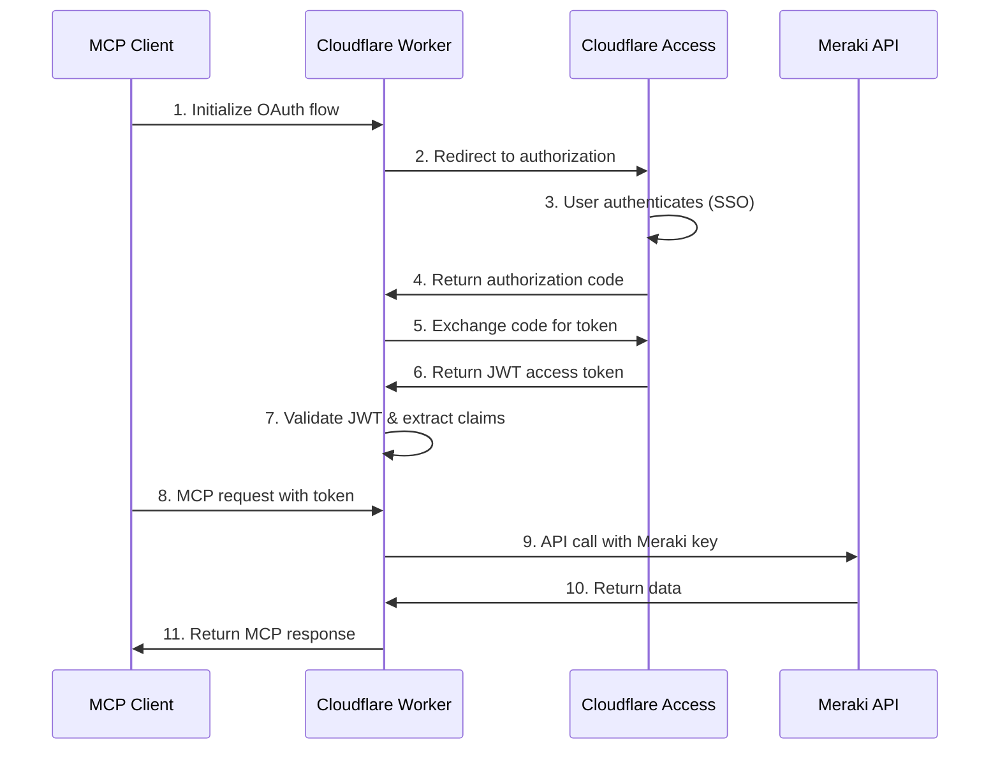

# 🌐 Cisco Meraki MCP Server

[](https://www.typescriptlang.org/)
[](https://workers.cloudflare.com/)
[](https://modelcontextprotocol.io/)
[](https://meraki.cisco.com/)
[](https://www.gnu.org/licenses/gpl-3.0)
[](https://github.com/macharpe/meraki-mcp-cloudflare/actions/workflows/semgrep.yml)

[](https://deploy.workers.cloudflare.com/?url=https://github.com/macharpe/meraki-mcp-cloudflare)

A Model Context Protocol (MCP) server that provides AI assistants with direct access to Cisco Meraki network management capabilities. Built on Cloudflare Workers with Durable Objects and OAuth 2.0 authentication via Cloudflare Access.

> **Prerequisites**: Requires a Cloudflare account and domain for custom domain setup and OAuth authentication.

> **Inspiration**: This implementation was inspired by [Censini/mcp-server-meraki](https://github.com/Censini/mcp-server-meraki) - credits to the original work for additional API method ideas.

## ✨ Features

### 🛠️ Available Tools

The server provides **18 comprehensive Meraki management tools**:

#### 🏢 Organization & Network Management

- **`get_organizations`** - List all organizations in your Meraki account
- **`get_organization`** - Get detailed information about a specific organization
- **`get_networks`** - List all networks within an organization
- **`get_network`** - Get detailed information about a specific network

#### 📱 Device Management

- **`get_devices`** - List all devices within a network
- **`get_device`** - Get detailed information about a specific device
- **`get_device_statuses`** - Get device statuses for an organization
- **`get_management_interface`** - Get management interface settings for a device

#### 🌐 Network Operations

- **`get_clients`** - Get clients connected to a network
- **`get_network_traffic`** - Get network traffic statistics
- **`get_network_events`** - Get recent network events

#### 🔗 Switch Management

- **`get_switch_ports`** - Get switch ports for a device
- **`get_switch_port_statuses`** - Get switch port statuses for a device
- **`get_switch_routing_interfaces`** - Get routing interfaces for a switch
- **`get_switch_static_routes`** - Get static routes for a switch

#### 📡 Wireless Management

- **`get_wireless_radio_settings`** - Get wireless radio settings for an access point
- **`get_wireless_status`** - Get wireless status of an access point
- **`get_wireless_latency_stats`** - Get wireless latency statistics for an access point

### 🎯 Key Benefits

- 🚀 **Serverless**: Runs on Cloudflare Workers with automatic scaling
- 🔒 **OAuth 2.0 Security**: Secure authentication via Cloudflare Access
- 🌐 **Custom Domain**: Professional branded domain with SSL
- 📱 **Real-time**: Live access to your Meraki dashboard data
- 💰 **Cost-effective**: Pay-per-use with Cloudflare Workers free tier
- ⚡ **Durable Objects**: Persistent MCP agent instances

## 🏗️ Architecture

```
┌─────────────────┐    ┌──────────────────┐    ┌─────────────────┐
│   MCP Client    │    │  Durable Object  │    │  Meraki API     │
│   (Claude)      │◄──►│  MCP Agent       │◄──►│  Dashboard      │
│                 │    │  + OAuth Handler │    │                 │
└─────────────────┘    └──────────────────┘    └─────────────────┘
    OAuth 2.0 Flow       Cloudflare Workers     HTTPS/REST API
         ▲                      ▲
         └──────────────────────┘
           Cloudflare Access
           (Identity Provider)
```

## 🔐 OAuth Authentication Flow

The server implements OAuth 2.0 with Cloudflare Access, providing secure authentication for MCP clients.



### OAuth Features

- **OAuth 2.0 + PKCE**: Secure authorization code flow with PKCE
- **JWT Tokens**: Cryptographically signed tokens from Cloudflare Access
- **User Approval**: Optional client approval dialog for consent management
- **Session Storage**: KV-based storage for OAuth state and tokens
- **SSO Integration**: Supports Google, Azure AD, and other identity providers

### 📁 Project Structure

```text
meraki-mcp-cloudflare/
├── src/
│   ├── index.ts              # Main Durable Object MCP Agent
│   ├── access-handler.ts     # OAuth authentication handler
│   ├── workers-oauth-utils.ts# OAuth utility functions
│   ├── services/
│   │   └── merakiapi.ts      # Meraki API service layer
│   ├── types/
│   │   ├── env.ts            # Environment type definitions
│   │   └── meraki.ts         # Meraki API type definitions
│   └── errors.ts             # Custom error classes
├── wrangler.jsonc            # Cloudflare Workers configuration
├── package.json              # Dependencies and scripts
├── CLAUDE.md                 # Claude Code instructions
└── README.md                 # This file
```

## 📋 Prerequisites

Before deploying the server, ensure you have:

1. **🌐 Cloudflare Account**: Free account at [cloudflare.com](https://cloudflare.com)
2. **🌍 Domain in Cloudflare**: Your domain must be managed by Cloudflare for OAuth authentication
3. **🔑 Cisco Meraki Account**: With API access enabled
4. **🎫 Meraki API Key**: Generated from your Meraki Dashboard
5. **💻 Node.js**: Version 18 or higher
6. **📦 Git**: For cloning the repository

### 🔑 Getting Your Meraki API Key

1. Log into your [Meraki Dashboard](https://dashboard.meraki.com)
2. Navigate to **Organization > Settings > Dashboard API access**
3. Enable API access if not already enabled
4. Generate a new API key and copy it securely

## 🔐 Cloudflare Access OAuth Setup

Before deploying the server, you need to configure Cloudflare Access as the OAuth identity provider. This section walks you through creating the SaaS application that provides the OAuth secrets.

### 1. Create Cloudflare Access Application

1. **Navigate to Cloudflare Zero Trust**:
   - Go to [Cloudflare Dashboard](https://dash.cloudflare.com)
   - Select your account → **Zero Trust** → **Access** → **Applications**

2. **Create SaaS Application**:
   - Click **"Add an application"**
   - Select **"SaaS"** application type
   - Choose **"Custom"** as the SaaS provider

3. **Configure Application Details**:

   ```
   Application name: Meraki MCP Server
   Entity ID: meraki-mcp-server
   Name ID format: Email
   ```

4. **Set Application Domain**:
   - Enter your custom domain: `meraki-mcp.yourdomain.com`
   - This should match the domain in your `wrangler.jsonc` routes

### 2. Configure OAuth Settings

1. **OAuth 2.0 Settings**:
   - **Grant Type**: Authorization Code
   - **Redirect URI**: `https://meraki-mcp.yourdomain.com/callback`
   - **Scopes**: `openid email profile`

2. **Security Settings**:
   - Enable **PKCE** (Proof Key for Code Exchange)
   - Set **Token Lifetime**: 1 hour (3600 seconds)
   - Enable **Refresh Tokens**: Yes

### 3. Extract OAuth Configuration Values

After creating the application, Cloudflare will provide these values needed for your Worker secrets:

```bash
# From the SaaS application configuration page:
ACCESS_CLIENT_ID="your_oauth_client_id_here"
ACCESS_CLIENT_SECRET="your_oauth_client_secret_here"

# From your Cloudflare Zero Trust team settings:
ACCESS_TOKEN_URL="https://your-team.cloudflareaccess.com/cdn-cgi/access/token"
ACCESS_AUTHORIZATION_URL="https://your-team.cloudflareaccess.com/cdn-cgi/access/authorize"
ACCESS_JWKS_URL="https://your-team.cloudflareaccess.com/cdn-cgi/access/certs"
```

**Note**: Replace `your-team` with your actual Cloudflare Zero Trust team name (found in your team dashboard URL).

### 4. Configure Access Policies

Create access policies to control who can authenticate:

1. **Navigate to Policies**:
   - Go to **Zero Trust** → **Access** → **Policies**

2. **Create Application Policy**:
   - **Application**: Select your "Meraki MCP Server" app
   - **Action**: Allow
   - **Session Duration**: 1 day

3. **Set Include Rules** (choose one):

   ```
   # Option 1: Specific email addresses
   Rule type: Include
   Selector: Email
   Value: your-email@domain.com

   # Option 2: Email domain
   Rule type: Include  
   Selector: Email domain
   Value: yourdomain.com

   # Option 3: Everyone (not recommended)
   Rule type: Include
   Selector: Everyone
   ```

### 5. Generate Cookie Encryption Key

The `COOKIE_ENCRYPTION_KEY` is used to encrypt session data and approval cookies for security.

```bash
# Generate a secure 32-byte base64 key
openssl rand -base64 32
```

**Purpose**: This key encrypts:

- **Session cookies**: Contains OAuth state and user approval decisions
- **PKCE code verifier**: Stored temporarily during OAuth flow
- **User approval state**: Remembers which clients the user has approved

**Security Note**:

- Keep this key secret and secure
- If compromised, regenerate it (will invalidate all active sessions)
- Use a different key for each deployment environment

### 6. Test OAuth Configuration

Before deploying, verify your OAuth setup:

1. **Test Authorization URL**:

   ```bash
   curl -I "https://your-team.cloudflareaccess.com/cdn-cgi/access/authorize?client_id=YOUR_CLIENT_ID&response_type=code"
   ```

2. **Verify JWKS Endpoint**:

   ```bash
   curl "https://your-team.cloudflareaccess.com/cdn-cgi/access/certs"
   ```

3. **Check Team Configuration**:
   - Ensure your team domain is active
   - Verify your identity provider (Google, Azure, etc.) is configured
   - Test SSO login through the Access dashboard

## 🚀 Installation & Deployment

### 1. Clone the Repository

```bash
git clone https://github.com/macharpe/meraki-mcp-cloudflare.git
cd meraki-mcp-cloudflare
```

### 2. Install Dependencies

```bash
npm install
```

### 3. Configure Environment

Create a `.dev.vars` file for local development:

```bash
echo "MERAKI_API_KEY=your_meraki_api_key_here" > .dev.vars
```

### 4. Configure Custom Domain

Update `wrangler.jsonc` with your domain:

```jsonc
{
  "name": "meraki-mcp-cloudflare",
  "main": "src/index.ts",
  "compatibility_date": "2025-08-04",
  "compatibility_flags": ["nodejs_compat"],
  
  "vars": {
    "MERAKI_BASE_URL": "https://api.meraki.com/api/v1"
  },
  
  "durable_objects": {
    "bindings": [
      {
        "class_name": "MerakiMCPAgent",
        "name": "MCP_OBJECT"
      }
    ]
  },

  "kv_namespaces": [
    {
      "binding": "OAUTH_KV",
      "id": "your-kv-namespace-id"
    }
  ],
  
  "routes": [
    {
      "pattern": "meraki-mcp.yourdomain.com",
      "custom_domain": true
    }
  ],
  
  "workers_dev": false,
  "preview_urls": false
}
```

### 5. Create KV Namespace

Create a KV namespace for OAuth session storage:

```bash
npx wrangler kv:namespace create "OAUTH_KV"
```

Update the namespace ID in `wrangler.jsonc` with the returned ID.

### 6. Set Required Secrets

Set your API key and OAuth configuration as secrets:

```bash
# Required - Meraki API key
npx wrangler secret put MERAKI_API_KEY

# Required - OAuth configuration secrets
npx wrangler secret put ACCESS_CLIENT_ID
npx wrangler secret put ACCESS_CLIENT_SECRET
npx wrangler secret put ACCESS_TOKEN_URL
npx wrangler secret put ACCESS_AUTHORIZATION_URL
npx wrangler secret put ACCESS_JWKS_URL
npx wrangler secret put COOKIE_ENCRYPTION_KEY
```

### 7. Deploy to Cloudflare Workers

First, authenticate with Cloudflare:

```bash
npx wrangler login
```

Deploy the server:

```bash
npx wrangler deploy
```

Your server will be available at: `https://meraki-mcp.yourdomain.com`

## ⚙️ Claude Desktop Configuration

### 💻 Setup Instructions

1. **Locate your Claude Desktop config file**:
   - **macOS**: `~/Library/Application Support/Claude/claude_desktop_config.json`
   - **Windows**: `%APPDATA%\Claude\claude_desktop_config.json`

2. **Add the Meraki MCP server configuration**:

```json
{
  "mcpServers": {
    "meraki": {
      "command": "npx",
      "args": [
        "workers-mcp",
        "https://meraki-mcp.yourdomain.com"
      ]
    }
  }
}
```

3. **Replace with your actual values**:
   - `yourdomain.com` → Your actual domain configured in Cloudflare

4. **Restart Claude Desktop** completely (quit and relaunch)

### ✅ Verify Configuration

Check that the server is properly connected:

1. Open Claude Desktop
2. Start a new conversation  
3. Try: "List my Meraki organizations"

The first time you use the server, you'll be prompted to complete OAuth authentication in your browser.

## 🌍 Environment Variables

The server uses these environment variables:

### Required

- **`MERAKI_API_KEY`** - Your Cisco Meraki API key (stored as Worker secret)
- **`ACCESS_CLIENT_ID`** - OAuth client ID from Cloudflare Access
- **`ACCESS_CLIENT_SECRET`** - OAuth client secret from Cloudflare Access
- **`ACCESS_TOKEN_URL`** - OAuth token endpoint URL
- **`ACCESS_AUTHORIZATION_URL`** - OAuth authorization endpoint URL
- **`ACCESS_JWKS_URL`** - JWKS endpoint for token verification
- **`COOKIE_ENCRYPTION_KEY`** - Key for encrypting session cookies

### Optional

- **`MERAKI_BASE_URL`** - Base URL for Meraki API (defaults to `https://api.meraki.com/api/v1`)

### Setting Secrets

```bash
# Required
npx wrangler secret put MERAKI_API_KEY
npx wrangler secret put ACCESS_CLIENT_ID
npx wrangler secret put ACCESS_CLIENT_SECRET
npx wrangler secret put ACCESS_TOKEN_URL
npx wrangler secret put ACCESS_AUTHORIZATION_URL
npx wrangler secret put ACCESS_JWKS_URL
npx wrangler secret put COOKIE_ENCRYPTION_KEY
```

## 💡 Usage Examples

Once connected to Claude Desktop, you can use natural language to interact with your Meraki infrastructure:

### 🏢 Get Organizations

```
"Show me all my Meraki organizations"
```

### 🌐 List Networks

```
"Get all networks in organization 123456"
```

### 📱 View Devices

```
"List all devices in the main office network"
```

### 🔍 Device Details

```
"Get details for device with serial ABC123DEF456"
```

### 📡 Wireless Management

```text
"Show me the wireless status of access point with serial XYZ789"
"Get wireless latency statistics for the office AP"
```

### 🔗 Switch Operations

```text
"List all switch ports for device ABC123"
"Show me the routing interfaces for the core switch"
```

### 📊 Network Analytics

```text
"Get network traffic statistics for the main office"
"Show recent security events for organization 123456"
```

## 🌐 API Endpoints

The server exposes these HTTP endpoints:

- **`GET /`** - OAuth provider and MCP agent handler
- **`POST /`** - OAuth provider and MCP agent handler
- **`GET /authorize`** - OAuth authorization endpoint
- **`POST /authorize`** - OAuth approval handler
- **`GET /callback`** - OAuth callback handler
- **`GET /health`** - Health check endpoint

### Health Check Response

```json
{
  "status": "healthy",
  "timestamp": "2025-08-29T12:00:00.000Z",
  "service": "meraki-mcp-server",
  "hasApiKey": true,
  "oauthEnabled": true,
  "version": "1.0.0",
  "tools": 18,
  "durableObjects": ["MerakiMCPAgent"],
  "kvNamespaces": ["OAUTH_KV"]
}
```

## 🛠️ Development

### 📜 Available Scripts

```bash
npm run dev          # Start local development server
npm run build        # Build TypeScript to JavaScript  
npm run deploy       # Deploy to Cloudflare Workers
npm run lint         # Run ESLint
npm run format       # Format code with Prettier
```

### 🧪 Local Development

```bash
# Start local server
npm run dev

# Test health endpoint
curl http://localhost:8787/health

# Test with service tokens (if configured)
curl -H "CF-Access-Client-Id: your-client-id" \
     -H "CF-Access-Client-Secret: your-client-secret" \
     http://localhost:8787/health
```

### ➕ Adding New Tools

To add new Meraki API endpoints:

1. Add the method to `src/services/merakiapi.ts`
2. Define types in `src/types/meraki.ts`
3. Add the tool definition in `src/index.ts`
4. Add the tool handler in the switch statement

Example:

```typescript
// Add to tools array
{
  name: "get_clients",
  description: "Get clients connected to a network",
  inputSchema: {
    type: "object",
    properties: {
      networkId: { type: "string", description: "Network ID" }
    },
    required: ["networkId"]
  }
}

// Add to switch statement
case "get_clients":
  const clients = await merakiService.getClients(args.networkId);
  return { content: [{ type: "text", text: JSON.stringify(clients, null, 2) }] };
```

## 🔒 Security Features

### 🛡️ Zero Trust Architecture

- **Cloudflare Access**: Enterprise-grade authentication at the edge
- **Service Tokens**: Machine-to-machine authentication without user interaction
- **Custom Domain**: Professional branded endpoint with automatic SSL
- **Edge Validation**: All authentication happens at Cloudflare's edge before reaching your Worker

### 🔐 Data Protection

- **API Keys**: Stored as encrypted Cloudflare Worker secrets
- **JWT Validation**: Cloudflare Access provides signed JWT tokens
- **HTTPS Only**: All communication encrypted in transit
- **No Data Storage**: Server is stateless with no data persistence

### 🚨 Access Control

- **AUD Token**: Application-specific audience validation
- **Team Domain**: Organization-level access control
- **Rate Limiting**: Built-in DDoS protection via Cloudflare
- **Geographic Controls**: Optional geo-blocking capabilities

## 🐛 Troubleshooting

### ⚠️ Common Issues

**"MERAKI_API_KEY not configured"**

- Ensure you've set the secret: `npx wrangler secret put MERAKI_API_KEY`

**"403 Forbidden" from custom domain**  

- Check Cloudflare Access configuration
- Verify service tokens are correct
- Ensure domain is properly configured in Cloudflare

**"Server disconnected" in Claude Desktop**

- Check your Claude Desktop config file syntax
- Verify service tokens are correctly formatted
- Restart Claude Desktop after config changes

**"Unauthorized - Valid service token required"**

- Verify service tokens in Claude Desktop config
- Check that Cloudflare Access application is properly configured
- Ensure the custom domain is working

### 🔍 Debugging

Check Cloudflare Workers logs:

```bash
npx wrangler tail
```

View Claude Desktop MCP logs:

```bash
# macOS
tail -f ~/Library/Logs/Claude/mcp-server-meraki.log

# Windows
Get-Content $env:APPDATA\Claude\logs\mcp-server-meraki.log -Wait
```

Test authentication manually:

```bash
curl -H "CF-Access-Client-Id: your-client-id" \
     -H "CF-Access-Client-Secret: your-client-secret" \
     https://meraki-mcp.yourdomain.com/health
```

## 🤝 Contributing

1. Fork the repository
2. Create a feature branch: `git checkout -b feature/new-tool`
3. Make your changes and test locally
4. Commit your changes: `git commit -am 'Add new tool'`
5. Push to the branch: `git push origin feature/new-tool`
6. Submit a pull request

## 📄 License

This project is licensed under the GNU General Public License v3.0 - see the [LICENSE](LICENSE) file for details.

## 📊 Code Statistics

### Project Metrics

```
📁 Total Files: ~25
📄 Source Files: 7 TypeScript files
🛠️ Available Tools: 18 Meraki API methods
🔧 API Service Methods: 20+ methods
📦 Dependencies: 5 main packages (@modelcontextprotocol/sdk, agents, zod, @cloudflare/workers-oauth-provider, workers-mcp)
⚡ Architecture: Durable Objects + OAuth 2.0
```

### File Breakdown

```
src/
├── index.ts              # ~400 lines - Durable Object MCP Agent
├── access-handler.ts     # ~150 lines - OAuth authentication handler
├── workers-oauth-utils.ts# ~200 lines - OAuth utility functions
├── services/
│   └── merakiapi.ts      # ~190 lines - Meraki API service layer  
├── types/
│   ├── env.ts            # ~15 lines - Environment type definitions
│   └── meraki.ts         # ~308 lines - Meraki API type definitions
└── errors.ts             # ~19 lines - Custom error classes
```

### API Coverage

- **Organizations**: 2 methods (list, get details)
- **Networks**: 4 methods (list, details, traffic, events)  
- **Devices**: 4 methods (list, details, status, management)
- **Wireless**: 3 methods (radio settings, status, latency stats)
- **Switch**: 4 methods (ports, port status, routing, static routes)
- **Clients**: 1 method (network clients)

### Performance

- **Cold Start**: ~50ms on Cloudflare Workers (Durable Objects)
- **Response Time**: <100ms for most API calls  
- **Rate Limits**: Respects Meraki API limits (5 requests/second)
- **OAuth Flow**: ~2-3 second authentication flow

## 📚 Related Resources

- [Model Context Protocol (MCP)](https://modelcontextprotocol.io/)
- [Cisco Meraki API Documentation](https://developer.cisco.com/meraki/api/)
- [Cloudflare Workers Documentation](https://developers.cloudflare.com/workers/)
- [Cloudflare Access Documentation](https://developers.cloudflare.com/cloudflare-one/identity/service-tokens/)
- [Claude Desktop MCP Setup](https://modelcontextprotocol.io/quickstart/user)

## 💬 Support

For issues and questions:

- Create an issue in this repository
- Check the [MCP documentation](https://modelcontextprotocol.io/docs/tools/debugging)
- Review Cloudflare Workers [error handling](https://developers.cloudflare.com/workers/observability/errors/)
- Consult [OAuth Provider documentation](https://github.com/cloudflare/workers-oauth-provider)

---

*Last updated: August 2025*
