# 🌐 Cisco Meraki MCP Server

[](https://www.typescriptlang.org/)
[](https://workers.cloudflare.com/)
[](https://modelcontextprotocol.io/)
[](https://meraki.cisco.com/)
[](https://www.gnu.org/licenses/gpl-3.0)
[](https://github.com/macharpe/meraki-mcp-cloudflare/actions/workflows/semgrep.yml)

[](https://deploy.workers.cloudflare.com/?url=https://github.com/macharpe/meraki-mcp-cloudflare)

A production-ready, enterprise-grade Model Context Protocol (MCP) server that provides AI assistants with comprehensive access to Cisco Meraki network management capabilities. Built on Cloudflare Workers with Durable Objects, OAuth 2.1 authentication with PKCE, intelligent KV caching, and full RFC-compliant OAuth discovery support.

> **Inspiration**: This implementation was inspired by [Censini/mcp-server-meraki](https://github.com/Censini/mcp-server-meraki) and [mkutka/meraki-magic-mcp](https://github.com/mkutka/meraki-magic-mcp) - credits to both original works for API method ideas and implementation approaches.

## 📑 Table of Contents

- [Prerequisites](#-prerequisites)
- [Features](#-features)
- [Architecture](#-architecture)
- [Authentication](#-authentication)
- [Performance & Caching](#-performance--caching)
- [Environment Variables](#-environment-variables)
- [Project Structure](#-project-structure)
- [Installation & Deployment](#-installation--deployment)
- [Claude Configuration](#-claude-configuration)
- [Usage Examples](#-usage-examples)
- [Testing](#-testing)
- [Troubleshooting](#-troubleshooting)
- [Contributing](#-contributing)
- [License](#-license)
- [Acknowledgments](#-acknowledgments)

---

## 📋 Prerequisites

Before deploying the server, ensure you have:

1. **🌐 Cloudflare Account**: Free account at [cloudflare.com](https://cloudflare.com) with a domain configured
2. **🔑 Cisco Meraki Account**: With API access enabled
3. **🎫 Meraki API Key**: Generated from your [Meraki Dashboard](https://dashboard.meraki.com)
   - Navigate to **Organization > Settings > Dashboard API access**
   - Enable API access and generate a new API key
4. **💻 Node.js**: Version 18 or higher
5. **📦 Git**: For cloning the repository
6. **🔐 Cloudflare Access for SaaS**: Configured identity provider (Okta, Google Workspace, Azure AD, etc.)

---

## ✨ Features

### 🛠️ Available Tools

The server provides **27 comprehensive Meraki management tools** organized across multiple categories:

#### 🏢 Organization & Network Management (6 tools)
- `get_organizations`, `get_organization`, `get_networks`, `get_network`, `get_network_traffic`, `get_network_events`

#### 📱 Device Management (5 tools)
- `get_devices`, `get_device`, `get_device_statuses`, `get_clients`, `get_management_interface`

#### 🔗 Switch Management (4 tools)
- `get_switch_ports`, `get_switch_port_statuses`, `get_switch_routing_interfaces`, `get_switch_static_routes`

#### 📡 Wireless Management (8 tools)
- `get_wireless_radio_settings`, `get_wireless_status`, `get_wireless_latency_stats`, `get_wireless_rf_profiles`
- `get_wireless_channel_utilization`, `get_wireless_signal_quality`, `get_wireless_connection_stats`, `get_wireless_client_connectivity_events`

#### 🛡️ Appliance Management (4 tools)
- `get_appliance_vpn_site_to_site`, `get_appliance_content_filtering`, `get_appliance_security_events`, `get_appliance_traffic_shaping`

---

## 🏗️ Architecture

```
┌──────────────────┐      ┌─────────────────────┐      ┌──────────────────┐
│   MCP Client     │      │  Cloudflare Worker  │      │   Meraki API     │
│  (AI Playground) │◄────►│  Durable Object MCP │◄────►│   Dashboard      │
│  (Claude)        │      │  + OAuth Handler    │      │                  │
└──────────────────┘      └─────────────────────┘      └──────────────────┘
         │                          │
         │                          │
         └──────────────────────────┘
               Cloudflare Access
           (OAuth 2.1 + Enterprise SSO)
```

**Architecture Highlights:**
- **Durable Objects**: Stateful MCP agent with SQLite storage for session management
- **Multi-Layer Caching**: KV caching for organizations, networks, clients, and JWKS keys
- **Global Edge**: Deployed across 300+ Cloudflare data centers for low latency
- **Zero Trust**: Every request authenticated and verified via Cloudflare Access JWT tokens

---

## 🔐 Authentication

The server implements **OAuth 2.1 with PKCE** integrated with **Cloudflare Access for SaaS** for enterprise-grade authentication and authorization. All MCP endpoints (`/mcp` and `/sse`) are protected and require valid Cloudflare Access JWT tokens.

> 📋 **Detailed Documentation**: See [`docs/oauth-authentication-flow.md`](docs/oauth-authentication-flow.md) for the complete authentication architecture with detailed sequence diagrams.

### 🎯 Authentication Flow Overview

```mermaid
sequenceDiagram
    participant User as User
    participant Client as MCP Client<br/>(AI Playground)
    participant Worker as Meraki MCP<br/>Worker
    participant Access as Cloudflare<br/>Access
    participant SSO as Enterprise<br/>SSO (Okta)

    Note over User,SSO: 📱 User Connects to MCP Server

    Client->>Worker: 1. Connect to /mcp
    Worker-->>Client: 2. 401 Unauthorized<br/>(Need authentication)

    Note over User,SSO: 🔐 OAuth Flow Begins

    Client->>Worker: 3. Start OAuth flow
    Worker-->>User: 4. Show approval dialog

    User->>Worker: 5. Click "Approve"
    Worker->>Access: 6. Redirect to Access login

    Note over User,SSO: 👤 Enterprise SSO Authentication

    Access->>SSO: 7. SAML/OIDC login
    User->>SSO: 8. Enter credentials
    SSO-->>Access: 9. User authenticated

    Note over User,SSO: 🎫 Token Exchange

    Access-->>Worker: 10. Return auth code
    Worker->>Access: 11. Exchange code for JWT
    Access-->>Worker: 12. Cloudflare Access JWT
    Worker-->>Client: 13. Return access token

    Note over User,SSO: ✅ Authenticated Access

    Client->>Worker: 14. MCP requests with Bearer token
    Worker->>Worker: 15. Verify JWT signature
    Worker-->>Client: 16. Return Meraki data

    Note over User,SSO: Subsequent requests use cached token
```



**Key Takeaways:**
- 🔐 Users authenticate once via their enterprise SSO (Okta, Google, Azure AD, etc.)
- 🎫 Cloudflare Access issues a JWT token valid for 1 hour
- ✅ All subsequent MCP requests include the Bearer token
- ⚡ Token verification is cached for performance (~5ms vs ~100ms)

### 🔍 OAuth Infrastructure

The server provides RFC-compliant OAuth 2.1 endpoints:

| Endpoint | Purpose | Specification |
|----------|---------|---------------|
| `/.well-known/oauth-authorization-server` | OAuth metadata discovery | RFC 8414 |
| `/.well-known/oauth-protected-resource` | Resource server metadata | RFC 8707 |
| `/.well-known/jwks.json` | JSON Web Key Set for token verification | RFC 7517 |
| `/register` | Dynamic client registration | RFC 7591 |
| `/authorize` | Authorization endpoint (with PKCE) | RFC 7636 |
| `/callback` | OAuth callback handler | OAuth 2.1 |
| `/token` | Token exchange endpoint | OAuth 2.1 |
| `/mcp` | Protected MCP JSON-RPC endpoint | MCP Spec |
| `/sse` | Protected Server-Sent Events transport | MCP Spec |

---

## ⚡ Performance & Caching

The server implements intelligent **multi-layer KV caching** to optimize performance and reduce API calls to Meraki Dashboard:

### 🗄️ Cache Strategy

| Data Type | Cache TTL | Rationale |
|-----------|-----------|-----------|
| **Organization Lists** | 30 minutes | Organizations rarely change |
| **Network Lists** | 15 minutes | Moderate update frequency |
| **Client Lists** | 5 minutes | Clients connect/disconnect frequently |
| **JWKS Keys** | 1 hour | JWT verification keys are stable |

---

## 🌍 Environment Variables

The server uses the following environment variables:

### Required Secrets

Set these using `npx wrangler secret put <SECRET_NAME>`:

| Secret | Description | How to Get |
|--------|-------------|------------|
| `MERAKI_API_KEY` | Cisco Meraki Dashboard API key | [Generate from Meraki Dashboard](https://dashboard.meraki.com) → Organization > Settings > API |
| `ACCESS_CLIENT_ID` | Cloudflare Access client ID | From Access for SaaS application configuration |
| `ACCESS_CLIENT_SECRET` | Cloudflare Access client secret | From Access for SaaS application configuration |
| `ACCESS_TOKEN_URL` | Cloudflare Access token endpoint | From Access for SaaS application configuration |
| `ACCESS_AUTHORIZATION_URL` | Cloudflare Access authorization endpoint | From Access for SaaS application configuration |
| `ACCESS_JWKS_URL` | Cloudflare Access JWKS endpoint | From Access for SaaS application configuration |
| `COOKIE_ENCRYPTION_KEY` | 32-byte hex key for cookie encryption | Generate with: `openssl rand -hex 32` |

### Optional Configuration

These are already configured in `wrangler.jsonc` with sensible defaults. You can modify them if needed:

- `MERAKI_BASE_URL` - Meraki API base URL (default: `https://api.meraki.com/api/v1`)
- `CACHE_TTL_ORGANIZATIONS` - Organization cache TTL in seconds (default: `1800` = 30 minutes)
- `CACHE_TTL_NETWORKS` - Network cache TTL in seconds (default: `900` = 15 minutes)
- `CACHE_TTL_JWKS` - JWKS cache TTL in seconds (default: `3600` = 1 hour)

---

## 📁 Project Structure

```text
meraki-mcp-cloudflare/
├── src/
│   ├── index.ts                   # Main Durable Object MCP Agent
│   ├── access-handler.ts          # OAuth 2.1 authentication handler
│   ├── oauth-helpers.ts           # OAuth utility functions
│   ├── workers-oauth-utils.ts     # Workers OAuth utilities
│   ├── middleware/
│   │   └── auth.ts                # Authentication middleware
│   ├── services/
│   │   ├── merakiapi.ts           # Meraki API service layer with caching
│   │   └── cache.ts               # KV caching service
│   ├── types/
│   │   ├── env.ts                 # Environment variable type definitions
│   │   └── meraki.ts              # Meraki API type definitions
│   └── tests/
│       ├── index.test.ts          # MCP agent tests
│       └── auth.test.ts           # Authentication tests
├── docs/
│   ├── oauth-authentication-flow.md   # Complete OAuth flow documentation
│   └── authentication-flow.md         # Legacy authentication docs
├── scripts/
│   └── pre-deploy.sh              # Pre-deployment validation script
├── wrangler.jsonc                 # Cloudflare Workers configuration
├── package.json                   # Dependencies and npm scripts
├── tsconfig.json                  # TypeScript configuration
├── biome.json                     # Biome linter configuration
├── .claude/                       # Claude Code project instructions
│   └── CLAUDE.md
└── README.md                      # This file
```

---

## 🚀 Installation & Deployment

### 1. Clone the Repository

```bash
git clone https://github.com/macharpe/meraki-mcp-cloudflare.git
cd meraki-mcp-cloudflare
```

### 2. Install Dependencies

```bash
npm install
```

### 3. Create a SaaS App

Follow the [Cloudflare Access for SaaS MCP Server guide](https://developers.cloudflare.com/cloudflare-one/applications/configure-apps/mcp-servers/saas-mcp/#2-create-an-access-for-saas-app) to create your Access for SaaS application.

**Important**: Make note of these values - you'll need them later:

- ✅ **Client ID**
- ✅ **Client Secret**
- ✅ **Token Endpoint**
- ✅ **Authorization Endpoint**
- ✅ **Key Endpoint** (JWKS URL)

> **Access Control**: When creating the SaaS App, configure an Access policy to control who can authenticate and access your MCP server. This policy determines which users (based on email, group membership, identity provider, etc.) are authorized to connect. Only users who match your policy will be able to authenticate via enterprise SSO and use the MCP server.

### 4. Create KV Namespaces

Create two KV namespaces for OAuth session storage and API response caching:

```bash
# Create OAuth session storage namespace
npx wrangler kv:namespace create "OAUTH_KV"
# Output: id = "abc123..." - SAVE THIS

# Create cache storage namespace
npx wrangler kv:namespace create "CACHE_KV"
# Output: id = "def456..." - SAVE THIS
```

### 5. Configure Custom Domain

Update `wrangler.jsonc` with your domain and KV namespace IDs:

```jsonc
{
  "name": "meraki-mcp-cloudflare",
  "main": "src/index.ts",
  "compatibility_date": "2025-03-07",

  // KV namespaces - UPDATE THESE WITH YOUR IDS FROM STEP 4
  "kv_namespaces": [
    {
      "binding": "OAUTH_KV",
      "id": "YOUR_OAUTH_KV_ID_HERE"  // From step 4
    },
    {
      "binding": "CACHE_KV",
      "id": "YOUR_CACHE_KV_ID_HERE"  // From step 4
    }
  ],

  // Custom domain routing - UPDATE WITH YOUR DOMAIN
  "routes": [
    {
      "pattern": "meraki-mcp.yourdomain.com",  // Change to your domain
      "custom_domain": true
    }
  ],

  // Security: Disable public endpoints
  "workers_dev": false,
  "preview_urls": false
}
```

> **Note**: The KV namespace IDs shown above are placeholders. Replace them with the actual IDs from step 4.

### 6. Set Required Secrets

**First, generate a cookie encryption key:**

```bash
openssl rand -hex 32
```

Copy the output - you'll need it in the next step.

> **Reference**: See [Cloudflare's Configure a cookie encryption key](https://developers.cloudflare.com/cloudflare-one/applications/configure-apps/mcp-servers/saas-mcp/#3-configure-your-mcp-server) documentation for more details.

**Configure all required secrets using Wrangler:**

```bash
# Meraki API authentication
npx wrangler secret put MERAKI_API_KEY
# Enter your Meraki API key when prompted

# Cloudflare Access for SaaS credentials (from step 3)
npx wrangler secret put ACCESS_CLIENT_ID
npx wrangler secret put ACCESS_CLIENT_SECRET
npx wrangler secret put ACCESS_TOKEN_URL
npx wrangler secret put ACCESS_AUTHORIZATION_URL
npx wrangler secret put ACCESS_JWKS_URL

# Cookie encryption key (paste the output from openssl command above)
npx wrangler secret put COOKIE_ENCRYPTION_KEY
```

### 7. Configure Local Development (Optional)

For local testing with `wrangler dev`, create a `.dev.vars` file:

```bash
echo "MERAKI_API_KEY=your_meraki_api_key_here" > .dev.vars
```

> **Note**: The `.dev.vars` file is git-ignored for security. This is useful for local development but not required for production deployment.

### 8. Deploy to Cloudflare Workers

Authenticate with Cloudflare (first time only):

```bash
npx wrangler login
```

Deploy the server:

```bash
npx wrangler deploy
```

Your server will be available at: `https://meraki-mcp.yourdomain.com`

---

## ⚙️ Claude Configuration

### 📊 Client Compatibility Summary

The following table summarizes OAuth-protected MCP server compatibility based on testing with this server:

| Client | Status | OAuth Flow | MCP Handshake | Tools Available | Notes |
|--------|--------|------------|---------------|-----------------|-------|
| **Workers AI Playground** | ✅ **Works** | ✓ Complete | ✓ Complete | ✓ All 27 tools | Built by Cloudflare for OAuth MCP |
| **Claude Code (CLI)** | ✅ **Works** | ✓ Complete | ✓ Complete | ✓ All 27 tools | **Recommended** - Tested and verified working |
| **Claude.ai (Web)** | ⚠️ **Partial** | ✓ Complete | ✗ Incomplete | ✗ No tools | OAuth succeeds, handshake stalls after `initialize` |
| **Claude Desktop** | ❌ **Fails** | ✗ Callback error | ✗ N/A | ✗ N/A | `mcp-remote` can't resolve callback URI |

### ✅ Claude Code (CLI)

Claude Code has full OAuth support for remote MCP servers and works reliably.

**Add via CLI:**

```bash
claude mcp add --transport http --scope user meraki-mcp https://meraki-mcp.yourdomain.com/mcp
```

**Or manually add to `~/.claude.json`:**

```json
{
  "mcpServers": {
    "meraki-mcp": {
      "url": "https://meraki-mcp.yourdomain.com/mcp",
      "transport": "http"
    }
  }
}
```

When you start a new Claude Code session, it will automatically initiate the OAuth flow via your browser.

### 💻 Claude Desktop

> **⚠️ Compatibility Issue**: Based on testing, Claude Desktop has compatibility issues with OAuth-protected remote MCP servers. The `mcp-remote` package encounters callback URI resolution errors.
>
> **Error**: `Cannot find localhost callback URI from existing client information`
>
> **Workaround**: Use Workers AI Playground or Claude Code CLI instead.

<details>
<summary>Configuration (for future compatibility)</summary>

1. **Locate your Claude Desktop config file**:
   - **macOS**: `~/Library/Application Support/Claude/claude_desktop_config.json`
   - **Windows**: `%APPDATA%\Claude\claude_desktop_config.json`
   - **Linux**: `~/.config/Claude/claude_desktop_config.json`

2. **Add the Meraki MCP server configuration**:

```json
{
  "mcpServers": {
    "meraki-mcp": {
      "command": "npx",
      "args": [
        "-y",
        "mcp-remote@latest",
        "https://meraki-mcp.yourdomain.com/mcp"
      ]
    }
  }
}
```

3. **Restart Claude Desktop** completely (quit and relaunch)

</details>

### 🌐 Claude.ai (Website)

> **⚠️ Compatibility Issue**: Based on testing, Claude.ai's web interface has compatibility issues with OAuth-protected MCP servers. OAuth authentication completes successfully, but the MCP handshake stalls after the `initialize` call - it never progresses to `tools/list`, resulting in no tools being available.
>
> **Observed Behavior**:
> - ✓ OAuth discovery works
> - ✓ User authentication succeeds
> - ✓ JWT token obtained
> - ✓ `initialize` request completes
> - ✗ Connection reinitializes repeatedly instead of calling `tools/list`
>
> **Workaround**: Use Workers AI Playground or Claude Code CLI, which have full OAuth MCP support.

<details>
<summary>Configuration (for reference)</summary>

1. Navigate to [claude.ai](https://claude.ai)
2. Click on your profile → **Settings**
3. Go to **Integrations** → **Model Context Protocol**
4. Click **Add Server**
5. Enter:
   - **Name**: Meraki MCP Server
   - **URL**: `https://meraki-mcp.yourdomain.com`
6. Click **Connect**
7. Authenticate via your enterprise SSO when prompted

</details>

### 🔧 Claude Code (CLI)

Add to your MCP settings configuration:

```json
{
  "mcpServers": {
    "meraki-mcp": {
      "url": "https://meraki-mcp.yourdomain.com",
      "oauth": {
        "discoveryUrl": "https://meraki-mcp.yourdomain.com/.well-known/oauth-authorization-server"
      }
    }
  }
}
```

---

## 💡 Usage Examples

Once connected to Claude, you can use natural language to interact with your Meraki infrastructure:

### 🏢 Organization Management
```
"Show me all my Meraki organizations"
"Get details for organization 123456"
```

### 🌐 Network Operations
```
"List all networks in my main organization"
"Get network traffic statistics for the office network"
```

### 📱 Device Management
```
"Show me all devices in the SF office network"
"Get wireless status for access point Q2XX-YYYY-ZZZZ"
```

### 🔍 Client Information
```
"List all connected clients on the guest network"
"Show me connectivity events for MAC address XX:XX:XX:XX:XX:XX"
```

### 🔗 Switch Configuration
```
"Get switch port statuses for device ABC-123-DEF"
"Show routing interfaces on the core switch"
```

---

## 🧪 Testing & API Endpoints

### 🏥 Health Check

Test basic connectivity:

```bash
curl https://meraki-mcp.yourdomain.com/health
```

**Expected Response:**
```json
{
  "status": "OK",
  "service": "Cisco Meraki MCP Server",
  "timestamp": "2025-01-23T10:30:00.000Z",
  "oauthEnabled": true,
  "version": "1.0.0",
  "endpoints": [...]
}
```

### 🔍 OAuth Discovery

Test OAuth metadata discovery:

```bash
curl https://meraki-mcp.yourdomain.com/.well-known/oauth-authorization-server
```

### 🛠️ Development Commands

**Local Development:**
```bash
npm run dev          # Start development server
npm run build        # Compile TypeScript
npm run lint         # Run code linting
npm run lint:fix     # Auto-fix linting issues
npm run typecheck    # Type checking only
npm run pre-deploy   # Complete pre-deployment checks
```

**Deployment:**
```bash
npm run deploy       # Deploy to Cloudflare Workers
npm run types        # Generate Cloudflare types
```

**Monitoring:**
```bash
npx wrangler tail --format pretty  # Real-time logs
```

---

## 🔧 Troubleshooting

**Common Issues:**

1. **OAuth Authentication Failures**
   - Verify Cloudflare Access configuration matches secrets
   - Check redirect URI matches exactly (no trailing slash)
   - Ensure domain is properly configured in Cloudflare

2. **KV Namespace Errors**
   - Verify KV namespace IDs in `wrangler.jsonc` match those from `kv:namespace create`
   - Check KV namespaces exist in Cloudflare dashboard

3. **Meraki API Errors**
   - Verify API key is valid and not expired
   - Check API key has proper organization access
   - Ensure rate limits aren't exceeded (5 req/sec)

4. **CORS Issues**
   - Server includes proper CORS headers automatically
   - Check browser console for specific CORS errors
   - Verify `mcp-protocol-version` header is allowed

**Debug Mode:**

Enable detailed logging:

```bash
npx wrangler tail --format pretty | grep '\[AUTH\]'  # Authentication logs
npx wrangler tail --format pretty | grep '\[CACHE\]' # Cache performance
```

---

## 🤝 Contributing

Contributions are welcome! Please feel free to submit a Pull Request. For major changes, please open an issue first to discuss what you would like to change.

---

## 📄 License

This project is licensed under the GPL-3.0 License - see the [LICENSE](LICENSE) file for details.

---

## 🙏 Acknowledgments

- **Cloudflare Workers**: For providing an excellent serverless platform
- **Model Context Protocol**: For creating the MCP specification
- **Cisco Meraki**: For their comprehensive API
- **[Censini/mcp-server-meraki](https://github.com/Censini/mcp-server-meraki)**: Original inspiration for this implementation
- **[mkutka/meraki-magic-mcp](https://github.com/mkutka/meraki-magic-mcp)**: Additional inspiration for API methods and implementation approaches

---

**Built with ❤️ using Cloudflare Workers and the Model Context Protocol**
