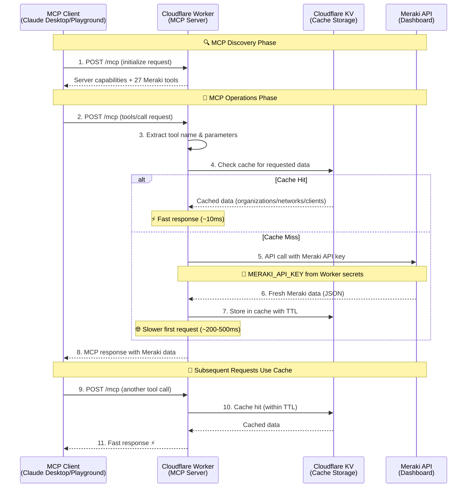
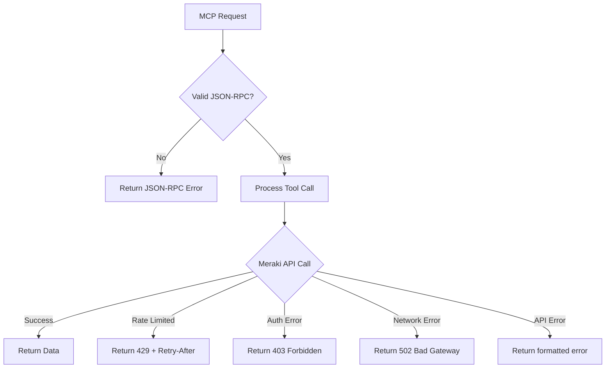

# 🔐 Authentication Flow

This document describes the authentication and authorization flow for the Cisco Meraki MCP Server.

## Current Architecture: API Key Authentication

The MCP server uses **Meraki API key authentication** for simplicity and direct access. MCP endpoints are publicly accessible, and authentication happens at the Meraki API layer.

## ⚡ Performance Optimization with KV Caching

The server implements intelligent caching to optimize performance and reduce API calls:

### Cache Implementation Details

- **Cache Keys**: Namespaced keys like `meraki:organizations`, `meraki:networks:123456`, `meraki:clients:123456:86400`
- **TTL Configuration**: Environment variables for configurable cache timeouts
  - `CACHE_TTL_ORGANIZATIONS`: Default 1800 seconds (30 minutes)
  - `CACHE_TTL_NETWORKS`: Default 900 seconds (15 minutes)
- **Graceful Fallback**: If KV unavailable, falls back to direct API calls
- **Global Replication**: Cached across all Cloudflare edge locations
- **Pagination Support**: Automatically handles large datasets (e.g., client lists)

## Authentication Details

### 🔑 Meraki API Key

- Stored as Cloudflare Worker secret: `MERAKI_API_KEY`
- Set via: `wrangler secret put MERAKI_API_KEY`
- Used for all Meraki Dashboard API calls
- Single key shared across all MCP client connections

### 🔒 Security Considerations

**Current Architecture:**

- ✅ Simple and direct access
- ✅ No OAuth complexity
- ✅ Works with all MCP clients immediately
- ✅ API key securely stored in Worker secrets (encrypted)
- ✅ Edge security via Cloudflare's network (DDoS, WAF)
- ✅ HTTPS-only connections (TLS 1.3)
- ⚠️ MCP endpoints are publicly accessible (no user authentication)
- ⚠️ All users share the same Meraki API key
- ⚠️ No per-user access control or audit logging

**Deployment Best Practices:**

- Use custom domain (avoid public workers.dev URLs)
- Keep Meraki API key restricted to minimum required permissions
- Monitor Worker logs for unusual activity
- Consider rate limiting at the Worker level if needed
- Regularly rotate Meraki API keys

## Endpoints Summary

| Endpoint | Purpose | Auth Required | Method |
|----------|---------|---------------|---------|
| `/mcp` | MCP JSON-RPC endpoint | No (public) | GET/POST |
| `/sse` | Server-Sent Events transport | No (public) | GET |
| `/health` | Health check | No (public) | GET |

## Error Handling

## Architecture Benefits

1. **🚀 Simplicity**: Direct MCP access without authentication complexity
2. **⚡ Performance**: Global edge deployment with intelligent KV caching (10-50x faster responses)
3. **💰 Cost Optimization**: Reduced Meraki API calls and Worker execution time through caching
4. **🔧 Rate Limit Protection**: Cache prevents hitting Meraki's 5 requests/second limit
5. **🌐 Universal Compatibility**: Works with all MCP clients (Claude Desktop, Claude Code, Claude.ai, AI Playground)
6. **📊 Observability**: Comprehensive logging via `wrangler tail`
7. **🔄 Scalability**: Serverless architecture with automatic scaling
8. **🔓 Easy Setup**: No authentication configuration required - just add the MCP server URL