# 🔐 Authentication Flow Diagram

This document provides a comprehensive view of the authentication and authorization flow for the Cisco Meraki MCP Server.

## Complete OAuth 2.1 + PKCE Flow

```mermaid
sequenceDiagram
    participant Client as MCP Client<br/>(Claude Desktop)
    participant Browser as User Browser
    participant Worker as Cloudflare Worker<br/>(MCP Server)
    participant Access as Cloudflare Access<br/>(OAuth Provider)
    participant KV as Cloudflare KV<br/>(Token Storage)
    participant Meraki as Meraki API<br/>(Dashboard)

    Note over Client,Meraki: 🔍 OAuth Discovery Phase

    Client->>Worker: 1. GET /.well-known/oauth-authorization-server
    Worker-->>Client: OAuth metadata (endpoints, scopes, PKCE support)

    Client->>Worker: 2. POST /register (optional)
    Worker->>KV: Store client registration
    Worker-->>Client: Client credentials (client_id, client_secret)

    Note over Client,Meraki: 🚀 Authorization Phase

    Client->>Client: 3. Generate PKCE code_verifier & code_challenge
    Client->>Worker: 4. GET /authorize?client_id=...&code_challenge=...
    Worker->>KV: Store code_verifier with state
    Worker-->>Client: 5. Redirect to Cloudflare Access

    Client->>Browser: 6. Open authorization URL
    Browser->>Access: 7. GET authorization endpoint
    Access-->>Browser: 8. Present login page (SSO/IdP)

    Note over Browser,Access: User authenticates with Identity Provider

    Browser->>Access: 9. User credentials (email/password/SSO)
    Access->>Access: 10. Validate with configured IdP
    Access-->>Browser: 11. Redirect with authorization code

    Browser->>Worker: 12. GET /callback?code=...&state=...
    Worker->>KV: 13. Retrieve code_verifier
    Worker->>Access: 14. POST /token (code + code_verifier)
    Access-->>Worker: 15. JWT access_token + id_token
    Worker->>Worker: 16. Verify JWT & extract user claims
    Worker-->>Client: 17. Redirect with MCP authorization code

    Note over Client,Meraki: 🔑 Token Exchange Phase

    Client->>Worker: 18. POST /token (MCP auth code)
    Worker->>Worker: 19. Generate MCP access token
    Worker-->>Client: 20. MCP access token + metadata

    Note over Client,Meraki: 📡 MCP Operations Phase

    Client->>Worker: 21. POST /mcp (JSON-RPC + Bearer token)
    Worker->>Worker: 22. Validate MCP token & extract user context
    Worker->>KV: 23. Check cache for requested data
    alt Cache Hit
        KV-->>Worker: Cached data (organizations/networks)
    else Cache Miss
        Worker->>Meraki: API call with Meraki API key
        Meraki-->>Worker: Fresh Meraki data (JSON)
        Worker->>KV: Store in cache with TTL
    end
    Worker-->>Client: 24. MCP response with Meraki data

    Note over Client,Meraki: 🔄 Refresh Flow (when needed)

    Client->>Worker: 26. POST /token (refresh_token)
    Worker->>Access: 27. Refresh with Cloudflare Access
    Access-->>Worker: 28. New access_token
    Worker-->>Client: 29. New MCP access token
```

## ⚡ Performance Optimization with KV Caching

The server implements intelligent caching to optimize performance and reduce API calls:

```mermaid
flowchart TD
    A[MCP Tool Request] --> B{Cache Check}
    B -->|Hit| C[Return Cached Data<br/>⚡ ~10ms response]
    B -->|Miss| D[Call Meraki API<br/>🌐 ~200-500ms response]
    D --> E[Store in KV Cache<br/>🗄️ with TTL]
    E --> F[Return Fresh Data]

    G[Cache Strategy] --> H[Organizations: 30min TTL]
    G --> I[Networks: 15min TTL]
    G --> J[JWKS Keys: 1hr TTL]

    K[Benefits] --> L[💰 Reduced API costs]
    K --> M[🚀 Faster responses]
    K --> N[🔧 Rate limit protection]
    K --> O[🌐 Global edge caching]
```

### Cache Implementation Details

- **Cache Keys**: Namespaced keys like `meraki:organizations`, `meraki:networks:123456`
- **TTL Configuration**: Environment variables for configurable cache timeouts
- **Graceful Fallback**: If KV unavailable, falls back to direct API calls
- **Global Replication**: Cached across all Cloudflare edge locations

## Key Security Features

### 🛡️ **PKCE (Proof Key for Code Exchange)**
- Prevents authorization code interception attacks
- Uses SHA256 code challenge method
- Code verifier stored securely in Cloudflare KV

### 🔐 **JWT Token Validation**
- ID tokens verified against Cloudflare Access JWKS
- User claims extracted for personalization
- Secure token binding between OAuth and MCP layers

### 🔒 **OAuth 2.1 Compliance**
- Modern OAuth specification adherence
- Support for refresh tokens
- Proper scope handling (`meraki:read`, `meraki:write`)

### 🌐 **Discovery Endpoints**
- RFC 8414 compliant discovery metadata
- Automatic client configuration support
- JWKS endpoint for public key discovery

## Error Handling

## Endpoints Summary

| Endpoint | Purpose | Method |
|----------|---------|---------|
| `/.well-known/oauth-authorization-server` | OAuth discovery metadata | GET |
| `/.well-known/jwks.json` | Public keys for token verification | GET |
| `/register` | Dynamic client registration | POST |
| `/authorize` | OAuth authorization endpoint | GET |
| `/callback` | OAuth callback handler | GET |
| `/token` | Token exchange endpoint | POST |
| `/mcp` | MCP JSON-RPC endpoint | GET/POST |
| `/sse` | Server-Sent Events (legacy) | GET |
| `/health` | Health check with endpoint list | GET |

## Benefits of This Architecture

1. **🔐 Enterprise Security**: Cloudflare Access integration with SSO support
2. **⚡ Performance**: Global edge deployment with intelligent KV caching (10-50x faster responses)
3. **💰 Cost Optimization**: Reduced Meraki API calls and Worker execution time through caching
4. **🎯 Standards Compliance**: Full OAuth 2.1 + PKCE + RFC 8414 support
5. **🛡️ MCP Portal Ready**: Compatible with Cloudflare MCP Portals
6. **🔧 Rate Limit Protection**: Cache prevents hitting Meraki's 5 requests/second limit
7. **📊 Observability**: Comprehensive logging and monitoring
8. **🔄 Scalability**: Serverless architecture with automatic scaling