# 🔐 Authentication Flow

This document describes the authentication and authorization flow for the Cisco Meraki MCP Server.

## Current Architecture: API Key Authentication

The MCP server uses **Meraki API key authentication** for simplicity and direct access. MCP endpoints are publicly accessible, and authentication happens at the Meraki API layer.

```mermaid
sequenceDiagram
    participant Client as MCP Client<br/>(Claude Desktop/Playground)
    participant Worker as Cloudflare Worker<br/>(MCP Server)
    participant KV as Cloudflare KV<br/>(Cache Storage)
    participant Meraki as Meraki API<br/>(Dashboard)

    Note over Client,Meraki: 🔍 MCP Discovery Phase

    Client->>Worker: 1. POST /mcp (initialize request)
    Worker-->>Client: Server capabilities + 27 Meraki tools

    Note over Client,Meraki: 📡 MCP Operations Phase

    Client->>Worker: 2. POST /mcp (tools/call request)
    Worker->>Worker: 3. Extract tool name & parameters
    Worker->>KV: 4. Check cache for requested data

    alt Cache Hit
        KV-->>Worker: Cached data (organizations/networks/clients)
        Note over Worker: ⚡ Fast response (~10ms)
    else Cache Miss
        Worker->>Meraki: 5. API call with Meraki API key
        Note over Worker,Meraki: 🔑 MERAKI_API_KEY from Worker secrets
        Meraki-->>Worker: 6. Fresh Meraki data (JSON)
        Worker->>KV: 7. Store in cache with TTL
        Note over Worker: 🌐 Slower first request (~200-500ms)
    end

    Worker-->>Client: 8. MCP response with Meraki data

    Note over Client,Meraki: 🔄 Subsequent Requests Use Cache

    Client->>Worker: 9. POST /mcp (another tool call)
    Worker->>KV: 10. Cache hit (within TTL)
    KV-->>Worker: Cached data
    Worker-->>Client: 11. Fast response ⚡
```

## ⚡ Performance Optimization with KV Caching

The server implements intelligent caching to optimize performance and reduce API calls:

```mermaid
flowchart TD
    A[MCP Tool Request] --> B{Cache Check}
    B -->|Hit| C[Return Cached Data<br/>⚡ ~10ms response]
    B -->|Miss| D[Call Meraki API<br/>🌐 ~200-500ms response]
    D --> E[Store in KV Cache<br/>🗄️ with TTL]
    E --> F[Return Fresh Data]

    G[Cache Strategy] --> H[Organizations: 30min TTL]
    G --> I[Networks: 15min TTL]
    G --> J[Clients: 5min TTL]
    G --> K[JWKS Keys: 1hr TTL]

    L[Benefits] --> M[💰 Reduced API costs]
    L --> N[🚀 Faster responses]
    L --> O[🔧 Rate limit protection]
    L --> P[🌐 Global edge caching]
```

### Cache Implementation Details

- **Cache Keys**: Namespaced keys like `meraki:organizations`, `meraki:networks:123456`, `meraki:clients:123456:86400`
- **TTL Configuration**: Environment variables for configurable cache timeouts
  - `CACHE_TTL_ORGANIZATIONS`: Default 1800 seconds (30 minutes)
  - `CACHE_TTL_NETWORKS`: Default 900 seconds (15 minutes)
  - `CACHE_TTL_JWKS`: Default 3600 seconds (1 hour)
- **Graceful Fallback**: If KV unavailable, falls back to direct API calls
- **Global Replication**: Cached across all Cloudflare edge locations
- **Pagination Support**: Automatically handles large datasets (e.g., client lists)

## Authentication Details

### 🔑 Meraki API Key

- Stored as Cloudflare Worker secret: `MERAKI_API_KEY`
- Set via: `wrangler secret put MERAKI_API_KEY`
- Used for all Meraki Dashboard API calls
- Single key shared across all MCP client connections

### 🔒 Security Considerations

**Current Model (API Key):**

- ✅ Simple and direct access
- ✅ No OAuth complexity
- ✅ Works with all MCP clients immediately
- ⚠️ All users share the same Meraki API key
- ⚠️ No per-user access control
- ⚠️ No audit logging of which user made which request

**Alternative Model (OAuth 2.1 + Cloudflare Access):**

- ✅ Per-user authentication via enterprise SSO
- ✅ User-level access control and audit logging
- ✅ Cloudflare Access policy enforcement
- ⚠️ More complex setup and configuration
- ⚠️ Requires user authentication before MCP access
- ⚠️ May not work with all MCP clients

## Endpoints Summary

| Endpoint | Purpose | Auth Required | Method |
|----------|---------|---------------|---------|
| `/mcp` | MCP JSON-RPC endpoint | No (public) | GET/POST |
| `/sse` | Server-Sent Events transport | No (public) | GET |
| `/health` | Health check with endpoint list | No (public) | GET |
| `/.well-known/oauth-authorization-server` | OAuth discovery metadata (for future use) | No (public) | GET |
| `/.well-known/jwks.json` | Public keys for token verification (for future use) | No (public) | GET |
| `/register` | Dynamic client registration (for future use) | No (public) | POST |
| `/authorize` | OAuth authorization endpoint (for future use) | No (public) | GET |
| `/callback` | OAuth callback handler (for future use) | No (public) | GET |
| `/token` | Token exchange endpoint (for future use) | No (public) | POST |

## OAuth Infrastructure (Available but Not Active)

The codebase includes OAuth 2.1 + PKCE infrastructure in `src/oauth-helpers.ts` and `src/access-handler.ts`, but it is **not currently protecting MCP endpoints**.

This infrastructure can be activated in the future if you need:

- Per-user authentication and authorization
- Enterprise SSO integration via Cloudflare Access for SaaS
- User-level audit logging
- Fine-grained access control

To activate OAuth protection, the routing logic in `src/index.ts` would need to be modified to route `/mcp` requests through `handleAccessRequest()` instead of `handleMcpRequest()` directly.

## Error Handling

## Benefits of Current Architecture

1. **🚀 Simplicity**: Direct MCP access without OAuth complexity
2. **⚡ Performance**: Global edge deployment with intelligent KV caching (10-50x faster responses)
3. **💰 Cost Optimization**: Reduced Meraki API calls and Worker execution time through caching
4. **🔧 Rate Limit Protection**: Cache prevents hitting Meraki's 5 requests/second limit
5. **🌐 Universal Compatibility**: Works with all MCP clients (Claude Desktop, Playground, custom clients)
6. **📊 Observability**: Comprehensive logging and monitoring
7. **🔄 Scalability**: Serverless architecture with automatic scaling
8. **🔓 Easy Setup**: No OAuth configuration required - just add the MCP server URL

## Future Enhancement: Cloudflare Access Integration

If enterprise-grade per-user authentication is needed in the future, the OAuth infrastructure can be activated by:

1. Configuring Cloudflare Access for SaaS application
2. Setting up identity provider (Okta, Google Workspace, etc.)
3. Modifying routing logic to protect `/mcp` endpoints
4. Configuring Access policies for user/group authorization

See the Cloudflare documentation for [Securing MCP servers with Access for SaaS](https://developers.cloudflare.com/cloudflare-one/applications/configure-apps/saas-apps/mcp-server/) for implementation details.
