# 🔐 OAuth 2.1 Authentication Flow

This document describes the OAuth 2.1 + Cloudflare Access for SaaS authentication flow for the Cisco Meraki MCP Server.

## Current Architecture: OAuth 2.1 with Cloudflare Access for SaaS

The MCP server now uses **OAuth 2.1 with PKCE** and **Cloudflare Access for SaaS** for enterprise-grade authentication and authorization. All MCP endpoints (`/mcp` and `/sse`) are protected and require a valid Cloudflare Access JWT token.

> 📋 **Quick Overview**: See the [README.md Authentication section](../README.md#-authentication) for a simplified high-level authentication flow diagram.

## 🔄 Complete Authentication Flow (Detailed)


## 🔑 Authentication Components

### 1. OAuth Discovery Endpoints

| Endpoint | Purpose | Spec |
|----------|---------|------|
| `/.well-known/oauth-authorization-server` | OAuth 2.1 Authorization Server Metadata | RFC 8414 |
| `/.well-known/oauth-protected-resource` | Resource Server Metadata | RFC 8707 |
| `/.well-known/jwks.json` | JSON Web Key Set for token verification | RFC 7517 |

### 2. OAuth Flow Endpoints

| Endpoint | Purpose | Method | Auth Required |
|----------|---------|--------|---------------|
| `/register` | Dynamic Client Registration | POST | No |
| `/authorize` | Authorization Code Request (with PKCE) | GET | No |
| `/authorize` | Approval Form Submission | POST | No |
| `/callback` | OAuth Callback Handler | GET | No |
| `/token` | Token Exchange Endpoint | POST | No |

### 3. Protected MCP Endpoints

| Endpoint | Purpose | Method | Auth Required |
|----------|---------|--------|---------------|
| `/mcp` | MCP JSON-RPC endpoint | GET/POST | **Yes (Bearer token)** |
| `/sse` | Server-Sent Events transport | GET | **Yes (Bearer token)** |

## 🔒 Security Features

### PKCE (Proof Key for Code Exchange)

The server implements **PKCE with SHA256** to prevent authorization code interception attacks:

1. **Client generates**:
   - `code_verifier`: Random 43-128 character string
   - `code_challenge`: Base64URL(SHA256(code_verifier))

2. **Authorization request** includes:
   - `code_challenge`: Sent to `/authorize`
   - `code_challenge_method`: "S256"

3. **Token exchange** includes:
   - `code_verifier`: Sent to `/token`
   - Server validates: SHA256(code_verifier) == code_challenge

This prevents attackers from using stolen authorization codes without the original code_verifier.

### JWT Token Verification

All Bearer tokens are verified against Cloudflare Access JWKS:


### Token Claims Validation

The server validates these JWT claims:

| Claim | Validation | Error if Invalid |
|-------|-----------|------------------|
| `exp` | Expiration time < current time | `expired_token` |
| `iss` | Matches Cloudflare Access issuer | `invalid_token` |
| `kid` | Key ID exists in JWKS | `invalid_token` |
| Signature | RSA signature verification | `invalid_token` |

### Access Control

Authorization is enforced through **Cloudflare Access policies**:

- Email domain verification (e.g., `@macharpe.com`)
- Group membership (e.g., `network-admins`)
- SAML/OIDC attributes (e.g., `department=IT`)
- Geographic restrictions
- Device posture checks

These policies are configured in the Cloudflare Zero Trust dashboard and enforced by Cloudflare Access before issuing tokens.

## ⚡ Performance Optimization

### Multi-Layer Caching Strategy

The authentication system implements intelligent caching:

```mermaid
flowchart TD
    A[Authentication Request] --> B{Token in Request?}
    B -->|No| C[Return 401<br/>Initiate OAuth Flow]
    B -->|Yes| D{JWKS Cache Check}

    D -->|Hit| E[Fast Verification<br/>⚡ ~5ms]
    D -->|Miss| F[Fetch JWKS<br/>🌐 ~50-100ms]
    F --> G[Cache JWKS 1hr]
    G --> E

    E --> H{MCP Data Cache?}
    H -->|Hit| I[Return Cached Data<br/>⚡ ~10ms total]
    H -->|Miss| J[Call Meraki API<br/>🌐 ~200-500ms]
    J --> K[Cache Meraki Data]
    K --> L[Return Fresh Data]

    M[Cache Layers] --> N[JWKS: 1 hour TTL]
    M --> O[Organizations: 30min TTL]
    M --> P[Networks: 15min TTL]
    M --> Q[Clients: 5min TTL]
```



### Cache Performance Metrics

| Data Type | First Request | Cached Request | Speedup |
|-----------|--------------|----------------|---------|
| JWKS Keys | ~50-100ms | ~5ms | **10-20x faster** |
| Organizations | ~200-500ms | ~10ms | **20-50x faster** |
| Networks | ~200-500ms | ~10ms | **20-50x faster** |
| Clients | ~300-800ms | ~10ms | **30-80x faster** |

### Cache Keys

All cache keys are namespaced and Base64URL-encoded for uniqueness:

```typescript
// JWKS keys cache
`jwks:${base64urlEncode(ACCESS_JWKS_URL)}`

// OAuth state cache
`code_verifier:${base64urlEncode(JSON.stringify(oauthReqInfo))}`

// Authorization code cache
`auth_code:${code}`

// Client registration cache
`client:${clientId}`

// Meraki data cache
`meraki:organizations`
`meraki:networks:${organizationId}`
`meraki:clients:${networkId}:${timespan}`
```

## 🔍 Error Handling

### OAuth Errors (RFC 6749)

| Error Code | Description | HTTP Status |
|------------|-------------|-------------|
| `invalid_request` | Missing or invalid parameters | 400 |
| `invalid_client` | Client authentication failed | 401 |
| `invalid_grant` | Authorization code invalid/expired | 400 |
| `unsupported_grant_type` | Only `authorization_code` supported | 400 |
| `server_error` | Internal server error | 500 |

### Authentication Errors (Custom)

| Error Code | Description | HTTP Status |
|------------|-------------|-------------|
| `missing_token` | No Authorization header | 401 |
| `invalid_format` | Not "Bearer <token>" format | 401 |
| `invalid_token` | JWT signature verification failed | 401 |
| `expired_token` | JWT exp claim < current time | 401 |

### 401 Unauthorized Response Format

```json
{
  "jsonrpc": "2.0",
  "error": {
    "code": -32001,
    "message": "Authentication required",
    "data": {
      "authorization_uri": "https://meraki-mcp.macharpe.com/authorize",
      "token_endpoint": "https://meraki-mcp.macharpe.com/token",
      "error": "expired_token",
      "error_description": "expired token"
    }
  }
}
```

With HTTP headers:
```http
HTTP/1.1 401 Unauthorized
WWW-Authenticate: Bearer realm="Meraki MCP Server", authorization_uri="https://meraki-mcp.macharpe.com/authorize", error="expired_token", error_description="expired token"
Access-Control-Allow-Origin: *
Content-Type: application/json
```

## 🎯 Benefits of OAuth 2.1 Architecture

### Security Benefits

1. **🔐 Per-User Authentication**: Each user authenticates with their own enterprise credentials
2. **👥 Enterprise SSO Integration**: Supports Okta, Google Workspace, Azure AD, generic SAML/OIDC
3. **📊 Audit Logging**: Track which user made which MCP request
4. **🔒 Access Policies**: Enforce email domain, group membership, device posture
5. **🔑 Short-Lived Tokens**: 1-hour token expiration with automatic refresh
6. **🛡️ PKCE Protection**: Prevents authorization code interception attacks

### Performance Benefits

1. **⚡ JWKS Caching**: 10-20x faster token verification (5ms vs 50-100ms)
2. **🚀 Multi-Layer Caching**: Organizations, networks, clients cached globally
3. **💰 Reduced API Calls**: Cache hit ratio ~95% for frequently accessed data
4. **🌐 Edge Deployment**: Authentication and data served from nearest Cloudflare edge location
5. **📈 Scalability**: Serverless architecture with automatic scaling

### Operational Benefits

1. **🔧 Standards-Compliant**: OAuth 2.1, PKCE, OIDC, JWKS, RFC 8414/8707
2. **🎨 MCP Client Compatible**: Works with Cloudflare AI Playground, Claude Desktop, custom clients
3. **📱 Universal Compatibility**: CORS-enabled for browser-based clients
4. **🔍 Observability**: Comprehensive logging at every authentication step
5. **🔄 Automatic Token Refresh**: Seamless re-authentication flow
6. **🚫 Zero Trust**: No implicit trust, every request verified

## 🔧 Environment Variables

### Required OAuth Configuration

```bash
# Cloudflare Access for SaaS credentials
ACCESS_CLIENT_ID="<access-app-client-id>"
ACCESS_CLIENT_SECRET="<access-app-client-secret>"
ACCESS_TOKEN_URL="https://macharpe.cloudflareaccess.com/cdn-cgi/access/sso/oidc/.../token"
ACCESS_AUTHORIZATION_URL="https://macharpe.cloudflareaccess.com/cdn-cgi/access/sso/oidc/.../authorize"
ACCESS_JWKS_URL="https://macharpe.cloudflareaccess.com/cdn-cgi/access/sso/oidc/.../jwks"

# Cookie encryption for approval dialog
COOKIE_ENCRYPTION_KEY="<32-byte-hex-string>"

# Meraki API key (still required for backend API calls)
MERAKI_API_KEY="<meraki-dashboard-api-key>"
```

### Optional Cache Configuration

```bash
# Cache TTL overrides (seconds)
CACHE_TTL_ORGANIZATIONS="1800"  # 30 minutes
CACHE_TTL_NETWORKS="900"        # 15 minutes
CACHE_TTL_JWKS="3600"           # 1 hour
```

## 📊 Monitoring & Logging

### Authentication Logs

All authentication events are logged with `[AUTH]` prefix:

```javascript
// Successful authentication
[AUTH] User authenticated: matthieu@macharpe.com (f72e3555-6c10-59e3-aa73-a554ef4f4fca)

// Authentication failures
[AUTH] Authentication failed: missing_token - Authorization header is required
[AUTH] Authentication failed: expired_token - expired token
[AUTH] Authentication failed: invalid_token - failed to verify token
```

### Cache Logs

Cache operations logged with `[CACHE]` prefix:

```javascript
[CACHE] Hit for key: jwks:aHR0cHM6Ly9tYWNoYXJwZS5jbG91ZGZsYXJl...
[CACHE] Miss for key: meraki:organizations
[CACHE] Set key: meraki:networks:123456 (TTL: 900s)
```

### Real-Time Monitoring

```bash
# Monitor authentication events in real-time
wrangler tail --format pretty | grep '\[AUTH\]'

# Monitor cache performance
wrangler tail --format pretty | grep '\[CACHE\]'

# Monitor all MCP requests
wrangler tail --format pretty
```

## 🚀 Migration from API Key Authentication

If you're migrating from the previous API key architecture:

### Before (API Key)
```bash
# MCP client configuration
{
  "mcpServers": {
    "meraki": {
      "url": "https://meraki-mcp.macharpe.com/mcp"
    }
  }
}
```

### After (OAuth 2.1)
```bash
# MCP client configuration (with OAuth discovery)
{
  "mcpServers": {
    "meraki": {
      "url": "https://meraki-mcp.macharpe.com/mcp",
      "oauth": {
        "discoveryUrl": "https://meraki-mcp.macharpe.com/.well-known/oauth-authorization-server"
      }
    }
  }
}
```

**Key Changes:**
1. Users must authenticate via enterprise SSO before accessing MCP tools
2. Each user has their own token (no shared credentials)
3. Access is governed by Cloudflare Access policies
4. All MCP requests include `Authorization: Bearer <token>` header

## 📚 References

- [OAuth 2.1 Specification](https://oauth.net/2.1/)
- [RFC 7636 - PKCE](https://datatracker.ietf.org/doc/html/rfc7636)
- [RFC 8414 - OAuth Authorization Server Metadata](https://datatracker.ietf.org/doc/html/rfc8414)
- [RFC 8707 - OAuth Resource Server Metadata](https://datatracker.ietf.org/doc/html/rfc8707)
- [RFC 7517 - JSON Web Key (JWK)](https://datatracker.ietf.org/doc/html/rfc7517)
- [Cloudflare Access for SaaS](https://developers.cloudflare.com/cloudflare-one/applications/configure-apps/saas-apps/)
- [Model Context Protocol (MCP)](https://modelcontextprotocol.io/)
