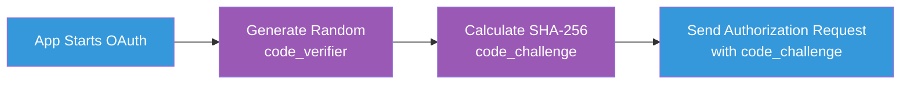
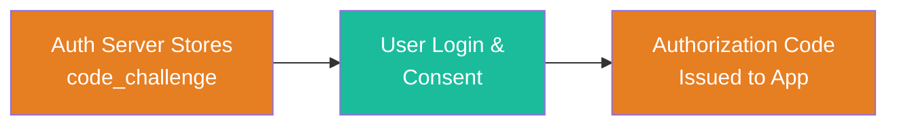
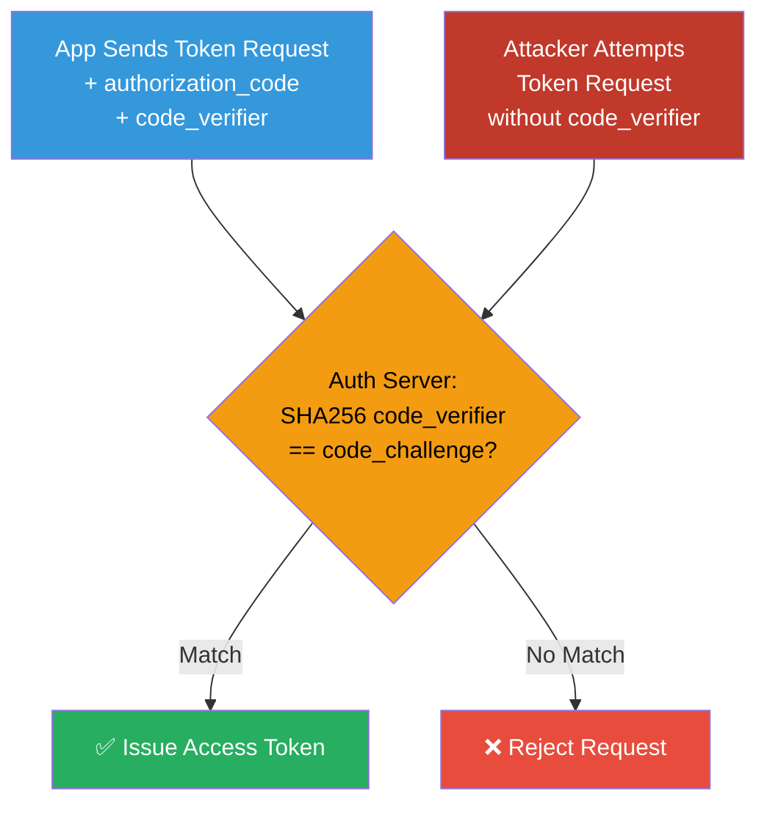
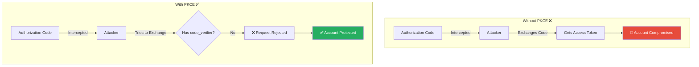

# 🔐 PKCE OAuth Flow Diagram

## Overview

This document illustrates how Proof Key for Code Exchange (PKCE) protects browser-based OAuth flows from authorization code interception attacks. The flow shows both the legitimate user path and how an attacker is prevented from exploiting intercepted codes.

---

## Complete PKCE Flow with Attack Prevention

```mermaid
sequenceDiagram
    participant App as Browser App
    participant User as User
    participant AuthServer as Authorization Server
    participant Attacker as 🎭 Attacker

    Note over App: 1. Generate PKCE Parameters
    App->>App: Generate random code_verifier
    App->>App: Calculate code_challenge = SHA256(code_verifier)
    
    Note over App,AuthServer: 2. Authorization Request
    App->>AuthServer: Authorization Request<br/>+ code_challenge<br/>+ code_challenge_method=S256
    
    Note over AuthServer: 3. Store Challenge
    AuthServer->>AuthServer: Store code_challenge<br/>for this session
    
    Note over AuthServer,User: 4. User Authentication
    AuthServer->>User: Login & Consent Screen
    User->>AuthServer: Approves Authorization
    
    Note over AuthServer,App: 5. Authorization Code Issued
    AuthServer->>App: Redirect with authorization_code
    
    rect rgb(70, 70, 70)
        Note over Attacker: ⚠️ ATTACK ATTEMPT
        Attacker->>Attacker: Intercepts authorization_code<br/>(but NOT code_verifier)
        Attacker->>AuthServer: Token Request<br/>+ authorization_code<br/>+ WRONG/MISSING code_verifier
        AuthServer->>AuthServer: Verify: SHA256(verifier) == challenge?
        AuthServer-->>Attacker: ❌ REJECTED<br/>Invalid code_verifier
    end

    rect rgb(50, 80, 50)
        Note over App,AuthServer: 6. Legitimate Token Request
        App->>AuthServer: Token Request<br/>+ authorization_code<br/>+ code_verifier (original)
        
        Note over AuthServer: 7. Verification
        AuthServer->>AuthServer: Verify: SHA256(code_verifier)<br/>== stored code_challenge?
        
        AuthServer-->>App: ✅ SUCCESS<br/>Access Token + Refresh Token
    end
    
    Note over App: App can now access<br/>protected resources
```



---

## Key Security Points

- 🔑 **code_verifier**: Random string (43-128 chars) that NEVER leaves the app
- 🔐 **code_challenge**: SHA-256 hash of code_verifier, sent to auth server
- ✅ **Why It Works**: The attacker can intercept the authorization code, but cannot compute the original code_verifier from the code_challenge (SHA-256 is one-way)
- ❌ **Attack Prevention**: Without the exact code_verifier that generated the code_challenge, the token exchange fails

---

## Step-by-Step Breakdown

### Phase 1: Initialization (Steps 1-2)



**Details:**
1. Browser app generates a cryptographically random string (code_verifier)
2. Computes SHA-256 hash of the verifier (code_challenge)
3. Sends authorization request with the challenge to the authorization server

---

### Phase 2: User Authorization (Steps 3-5)



**Details:**
1. Authorization server stores the code_challenge for this session
2. User authenticates and grants consent
3. Server issues authorization code back to the app

---

### Phase 3: Token Exchange & Verification (Steps 6-7)



**Details:**
1. Legitimate app sends token request with authorization code + original code_verifier
2. Server computes SHA-256 of the received verifier and compares to stored challenge
3. If they match → access token issued ✅
4. If they don't match (attacker scenario) → request rejected ❌

---

## Security Comparison: With vs Without PKCE



---

## Technical Implementation Details

### Code Verifier Generation

```javascript
// Generate random code_verifier (43-128 characters)
function generateCodeVerifier() {
    const array = new Uint8Array(32);
    crypto.getRandomValues(array);
    return base64URLEncode(array);
}
```

### Code Challenge Calculation

```javascript
// Calculate SHA-256 hash of code_verifier
async function generateCodeChallenge(verifier) {
    const encoder = new TextEncoder();
    const data = encoder.encode(verifier);
    const hash = await crypto.subtle.digest('SHA-256', data);
    return base64URLEncode(new Uint8Array(hash));
}
```

### Authorization Request

```http
GET /authorize?
    response_type=code&
    client_id=CLIENT_ID&
    redirect_uri=REDIRECT_URI&
    code_challenge=CODE_CHALLENGE&
    code_challenge_method=S256&
    scope=openid profile email
```

### Token Request (Legitimate)

```http
POST /token
Content-Type: application/x-www-form-urlencoded

grant_type=authorization_code&
code=AUTHORIZATION_CODE&
redirect_uri=REDIRECT_URI&
client_id=CLIENT_ID&
code_verifier=CODE_VERIFIER
```

### Token Request (Attacker - Fails)

```http
POST /token
Content-Type: application/x-www-form-urlencoded

grant_type=authorization_code&
code=AUTHORIZATION_CODE&
redirect_uri=REDIRECT_URI&
client_id=CLIENT_ID&
code_verifier=WRONG_OR_MISSING_VERIFIER
```

**Server Response:**
```json
{
  "error": "invalid_grant",
  "error_description": "Code verifier does not match code challenge"
}
```

---

## Why PKCE is Critical for Browser-Based Apps

### Public Clients Cannot Keep Secrets
Browser-based apps run entirely in the user's environment (JavaScript in the browser). Any "secret" embedded in the code can be extracted by:
- Inspecting the source code
- Monitoring network traffic
- Reverse-engineering the app

### The Attack PKCE Prevents

**Without PKCE:**
1. User initiates OAuth flow → authorization server issues an authorization code
2. Attacker intercepts the code (via malicious app, compromised redirect URI, etc.)
3. Attacker exchanges the code for an access token at the token endpoint
4. Attacker gains unauthorized access to user resources

**With PKCE:**
Even if an attacker intercepts the authorization code, they cannot exchange it without the original `code_verifier` (which never leaves the app and is never transmitted during the authorization step).

### Browser-Specific Risks
Browser environments have unique vulnerabilities:
- **Open redirect attacks** (malicious redirect URIs)
- **Cross-site scripting (XSS)** exposing codes in URL fragments
- **Browser history/logging** capturing authorization codes

PKCE ensures that even if a code leaks, it's useless without the verifier.

---

## Summary

PKCE is critical because:
- **Public clients** (browsers, mobile apps) cannot securely store secrets
- It cryptographically binds the authorization request to the token request
- It prevents authorization code interception/replay attacks
- It's now **required** by OAuth 2.1 for all public clients

**Without PKCE, browser-based OAuth flows are vulnerable to token theft. Enabling it is a foundational security control, not optional.**

---

## References

- [RFC 7636: Proof Key for Code Exchange by OAuth Public Clients](https://datatracker.ietf.org/doc/html/rfc7636)
- [OAuth 2.1 Draft Specification](https://datatracker.ietf.org/doc/html/draft-ietf-oauth-v2-1-09)
- [OAuth 2.0 for Browser-Based Apps (BCP)](https://datatracker.ietf.org/doc/html/draft-ietf-oauth-browser-based-apps)

---

*Generated: 2025-10-24*